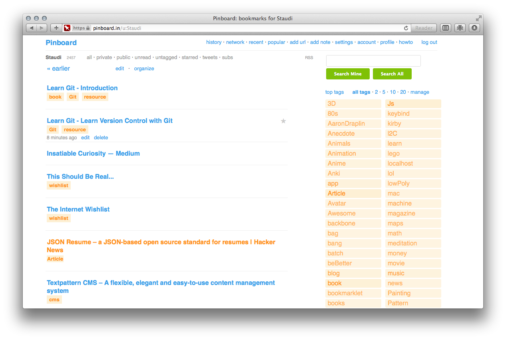
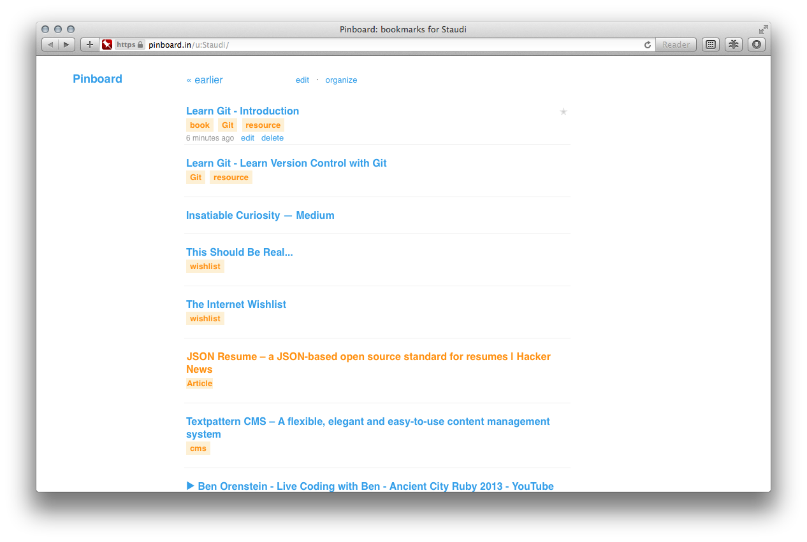

Pincss
======
Custom CSS styles for Pinboard.in.

Style.css
---------
Change colors and improve readability. Most of changes are here.

`style.css` is applied for `https://pinboard.in/username`.

Style+.css
----------
Second layer of changes to remove clutter.

`style+.css` is applied for `https://pinboard.in/username/` notice `/` at end.

Result
-----
Set homepage for new windows to `https://pinboard.in/username/`.
Now whenever you open new browser window you get quick acces to your latest bookmarks.
Visiting <Pinboard.in> or clicking on logo will give you full view.

Apps & Extensions
-----
+ [User CSS](http://code.grid.in.th) easy way to set custom css in Safari.
+ [Shori](http://aki-null.net/shiori) for instant search of <Pinboard.in> on Mac.
